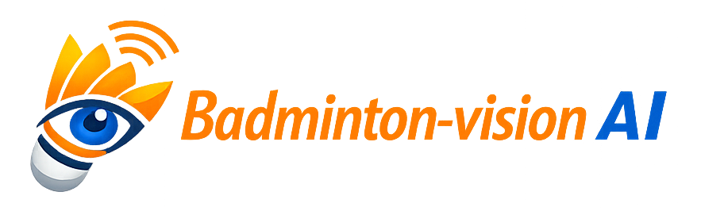
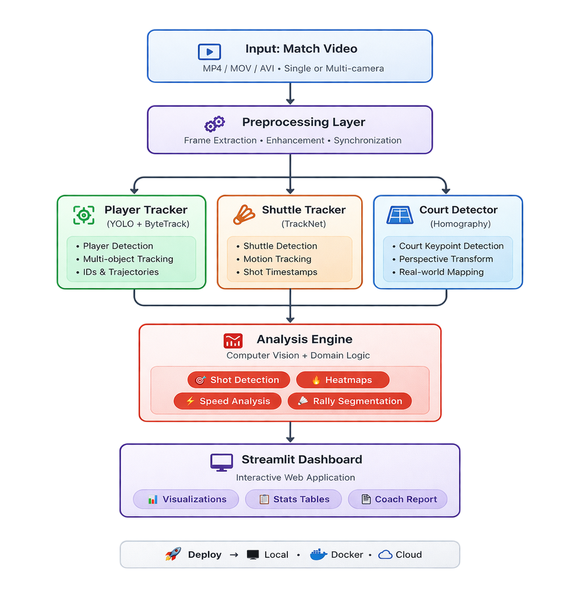

<div align="center">




#### AI-Powered Badminton Performance Analysis System

[](https://python.org)
[](https://pytorch.org)
[](https://ultralytics.com)
[](https://streamlit.io)
[](https://docker.com)
[](LICENSE.txt)
[]()

*Computer vision analytics for professional badminton performance*

**[Features](#-features) · [Architecture](#-system-architecture) · [Quick Start](#-quick-start) · [Installation](#-installation) · [Usage](#-usage) · [Dashboard](#-dashboard) · [Roadmap](#-roadmap)**

</div>

---

## 🎯 Overview

**Badminton-VisionAI** is an end-to-end AI pipeline that transforms raw match footage into actionable performance intelligence. Built on state-of-the-art computer vision models, it delivers frame-accurate player tracking,  shuttlecock trajectory reconstruction, intelligent shot classification, and coach-ready analytics — all packaged in an interactive dashboard.

<div align="center">

### Tracking


Player & shuttle tracking · Court mapping · Shot detection

### Analytics


Heatmap · Players & Shots statistics · Coach report

</div>

---

## ✨ Features

### 🎥 Computer Vision Pipeline
- **Player Detection & Tracking** — Player detection using YOLO, integrated with ByteTrack for robust multi-player tracking and persistent IDs across frames
- **Shuttlecock Tracking** — TrackNet-powered trajectory prediction handling occlusions and motion blur
- **Court Detection** — Automatic keypoint detection and homography estimation for court-plane normalization
- **Segment Anything (SAM)** — Precise player segmentation for fine-grained movement analysis

<p align="center">• • •</p>

### 📐 Spatial Analysis
- **Homography Projection** — Transforms camera-perspective player positions onto a canonical 2D mini-court view
- **Heatmap Generation** — Positional frequency maps revealing court coverage patterns per player
- **Trajectory Reconstruction** — Smoothed shuttlecock path with physics-aware interpolation for occluded frames

<p align="center">• • •</p>

### 🏸 Shot Intelligence
- **Shot Type Classification** — Detects smash, drop, clear, drive, net kill, and serve automatically
- **Power Estimation** — Velocity-based shuttlecock speed computation at moment of impact
- **Rally Segmentation** — Automatic rally start/end detection and per-rally statistics

<p align="center">• • •</p>

### 📊 Performance Dashboard
- **Interactive Streamlit UI** — Upload video, run the analysis pipeline, and explore results directly in the browser
- **Live Video Metrics** — Real-time overlays showing player velocity, acceleration, and shot type predictions on video frames
- **Per-Player Statistics** — Shot counts, movement distances, court coverage, rally durations, and shuttlecock analytics
- **Coach-Ready Reports** — Exportable PDF summaries with performance insights, tactical patterns, and strategy recommendations for player improvement

<p align="center">• • •</p>

### 🐳 Production-Ready
- **Dual Dockerfile setup** — Separate optimized containers for the CV pipeline and the web dashboard
- **Modular architecture** — Cleanly decoupled modules for tracking, analysis, detection, and visualization
- **Conda + pip support** — Both `environment.yml` and `requirements*.txt` provided

---

## 🏗️ System Architecture

<div align="center">

</div>

---

### Project Structure

```
Badminton-visionAI/
├── tracking/                     # Tracking modules
│   ├── court_detection/          # Keypoint detection & homography
│   ├── players_tracking/         # YOLO-based player tracking
│   ├── players_poses/            # Pose estimation (YOLO Pose)
│   └── shuttle_tracking/         # TrackNet ball tracking (models, predict, dataset)
├── shot_detection/               # Shot classification, power estimation, stabilizer
├── analysis/                     # Metrics, heatmaps, side-court projection, dashboard
├── webapp/                       # Streamlit dashboard
│   ├── pages/                    # match_replay, court_explorer, coach_report
│   ├── tabs/                     # positioning, shot_profile
│   └── reports/                  # PDF report helpers and page builders
├── utils/                        # Shared utilities (I/O, video, logger, conversions)
├── constants/                    # Court dimensions, player heights
├── config/                       # config.yaml, streamlitconfig.yaml
├── models/                       # Pretrained weights
│   ├── players_tracking/         # yolov8m.pt
│   ├── players_poses/            # yolo_poses_model.pt
│   ├── sam_model/                # sam.pth
│   └── shuttle_ball_tracking/    # TrackNet_best.pt, InpaintNet_best.pt
├── notebooks/                    # data_exploration.ipynb, training_models.ipynb
├── data/
│   ├── Input_videos/             # Drop your match videos here
│   ├── json/                     # Pipeline output JSON (read by dashboard)
│   └── images/                   # Sample court/player images
├── outputs/
│   └── tracking_results/         # Annotated output videos
├── logs/                         # Runtime logs per module
├── docs/                         # Extended documentation
├── app.py                        # ← Run this FIRST (CV pipeline entry point)
├── web.py                        # ← Run this SECOND (Streamlit dashboard)
├── Dockerfile.pipeline           # CV pipeline container
├── Dockerfile.web                # Web dashboard container
├── environment.yml               # Conda environment
├── requirements.pipeline.txt
└── requirements.web.txt
```

---

## 🚀 Quick Start

Badminton-VisionAI runs in **two sequential steps**: the CV pipeline processes your video and writes all output data first, then the web dashboard reads those outputs for interactive exploration.

### Step 1 — Run the CV Pipeline

```bash
# Clone the repository
git clone https://github.com/amramer/Badminton-visionAI.git
cd Badminton-visionAI

# Build and run the pipeline container
docker build -f Dockerfile.pipeline -t badminton-pipeline .
docker run --gpus all \
  -v $(pwd)/data/Input_videos:/app/data/Input_videos \
  -v $(pwd)/outputs:/app/outputs \
  -v $(pwd)/data/json:/app/data/json \
  badminton-pipeline \
  --input data/Input_videos/your_match.mp4 --output outputs/
```

This produces the annotated video and all JSON data files consumed by the dashboard.

### Step 2 — Launch the Web Dashboard

```bash
# Build and run the dashboard container (after the pipeline has finished)
docker build -f Dockerfile.web -t badminton-web .
docker run -p 8501:8501 \
  -v $(pwd)/outputs:/app/outputs \
  -v $(pwd)/data/json:/app/data/json \
  badminton-web

# Open your browser at http://localhost:8501
```

---


## 🛠️ Installation

### Option A — Conda (Recommended for full stack)

```bash
git clone https://github.com/amramer/Badminton-visionAI.git
cd Badminton-visionAI

conda env create -f environment.yml
conda activate badminton-visionai
```

### Option B — pip (CV pipeline only)

```bash
pip install -r requirements.pipeline.txt
```

### Option C — pip (Web dashboard only)

```bash
pip install -r requirements.web.txt
```

### Option D — Docker (Production, two containers)

```bash
# Container 1 — CV pipeline (run first)
docker build -f Dockerfile.pipeline -t badminton-pipeline .

# Container 2 — Web dashboard (run after pipeline completes)
docker build -f Dockerfile.web -t badminton-web .
```

### Prerequisites

| Requirement | Version |
|---|---|
| Python | ≥ 3.9 |
| PyTorch | ≥ 2.0 (CUDA recommended) |
| OpenCV | ≥ 4.8 |
| Streamlit | ≥ 1.32 |
| CUDA (optional) | ≥ 11.8 for GPU inference |

---

## 📖 Usage

### 1. Run the Full Pipeline on a Video

```bash
python app.py --input data/sample_match.mp4 --output outputs/
```

**Key arguments:**

| Argument | Default | Description |
|---|---|---|
| `--input` | — | Path to input video file |
| `--output` | `outputs/` | Directory for output files |
| `--conf` | `0.5` | YOLO detection confidence threshold |
| `--device` | `cuda` | Inference device (`cuda` / `cpu`) |
| `--save-video` | `False` | Save annotated output video |
| `--config` | `config/default.yaml` | Path to config file |

### 2. Launch the Interactive Dashboard

```bash
streamlit run web.py
```

Then navigate to `http://localhost:8501`, upload a video, and explore results interactively.

### 3. Run via Python API

```python
from tracking.player_tracker import PlayerTracker
from tracking.shuttle_tracker import ShuttleTracker
from analysis.heatmap import HeatmapGenerator

# Initialize components
player_tracker = PlayerTracker(conf=0.5, device="cuda")
shuttle_tracker = ShuttleTracker()

# Run on a video
results = player_tracker.track("data/match.mp4")
heatmap = HeatmapGenerator(results).generate()
heatmap.save("outputs/heatmap.png")
```

---

## 📊 Dashboard

The Streamlit dashboard provides an end-to-end interactive experience:

| Panel | Description |
|---|---|
| 📹 **Video Upload** | Drop in any MP4 match recording |
| 🎯 **Tracking View** | Annotated video with bounding boxes and IDs |
| 🗺️ **Mini-Court Map** | Real-time homographic court projection |
| 🔥 **Heatmaps** | Per-player court coverage and positioning frequency |
| 📈 **Shot Statistics** | Shot type breakdown, rally lengths, speed distribution |
| 📄 **Export** | Download CSV data or PDF coach report |

---

## 🧠 Models & Methods

| Component | Model / Method | Reference |
|---|---|---|
| Player Detection | YOLOv8 (Ultralytics) | [Paper](https://arxiv.org/abs/2304.00501) |
| Player Segmentation | SAM (Segment Anything) | [Paper](https://arxiv.org/abs/2304.02643) |
| Shuttle Tracking | TrackNet | [Paper](https://arxiv.org/abs/1907.10872) |
| Court Detection | Homography estimation (OpenCV) | — |
| Shot Classification | Custom CNN/rule-based on trajectory features | — |
| Tracking Algorithm | SORT / ByteTrack-style assignment | — |

---

## ⚙️ Configuration

All pipeline parameters are controlled via `config/default.yaml`:

```yaml
tracking:
  player_conf: 0.5          # YOLO confidence threshold
  iou_threshold: 0.45       # NMS IoU threshold
  max_age: 30               # Max frames before track is dropped

shuttle:
  model_path: models/tracknet.pth
  sequence_length: 3        # Input frames for TrackNet

court:
  keypoint_model: models/court_kp.pth
  homography_method: RANSAC

analysis:
  heatmap_resolution: [640, 360]
  shot_min_speed_kmh: 50    # Min shuttle speed to register as shot
```

---

## 📁 Output Files

After running the pipeline, the `outputs/` directory contains:

```
outputs/
├── tracking_results/
│   ├── player_tracks.json      # Frame-by-frame player positions & IDs
│   ├── shuttle_trajectory.json # Shuttlecock trajectory data
│   └── annotated_video.mp4     # Optional annotated video
├── analysis/
│   ├── heatmap_player1.png
│   ├── heatmap_player2.png
│   ├── shot_stats.csv
│   └── rally_segments.json
└── report/
    └── match_report.pdf
```

---

## 🗺️ Roadmap

- [x] Player detection and tracking (YOLO + SAM)
- [x] Shuttlecock tracking (TrackNet)
- [x] Court homography projection
- [x] Shot type and power estimation
- [x] Streamlit interactive dashboard
- [x] Docker containerization
- [ ] Multi-camera support and view stitching
- [ ] Real-time inference mode (RTSP / webcam input)
- [ ] Pose estimation integration (MediaPipe / ViTPose)
- [ ] 3D trajectory reconstruction
- [ ] REST API endpoint for external integrations
- [ ] Mobile-friendly dashboard (PWA)
- [ ] Automated highlight reel generation

---

## 🤝 Contributing

Contributions are very welcome! Here's how to get involved:

1. Fork the repository
2. Create a feature branch: `git checkout -b feature/your-feature-name`
3. Commit your changes: `git commit -m 'Add: brief description of change'`
4. Push to your branch: `git push origin feature/your-feature-name`
5. Open a Pull Request — describe what you did and why

Please check open [Issues](https://github.com/amramer/Badminton-visionAI/issues) before starting work to avoid duplication.

---

## 📄 License

This project is licensed under the **MIT License** — see [LICENSE.txt](LICENSE.txt) for details. You are free to use, modify, and distribute with attribution.

---

## 🙏 Acknowledgements

- [Ultralytics YOLOv8](https://github.com/ultralytics/ultralytics) — Player detection backbone
- [TrackNet](https://github.com/ChgygLin/TrackNet-pytorch) — Shuttlecock tracking architecture
- [Segment Anything (SAM)](https://github.com/facebookresearch/segment-anything) — Player segmentation
- [Streamlit](https://streamlit.io) — Dashboard framework
- [OpenCV](https://opencv.org) — Image processing and homography computation

---

<div align="center">

Made with ❤️ by [Amr Amer](https://github.com/amramer)

⭐ **If this project helps you, please give it a star!** ⭐

[](https://github.com/amramer/Badminton-visionAI)

</div>
